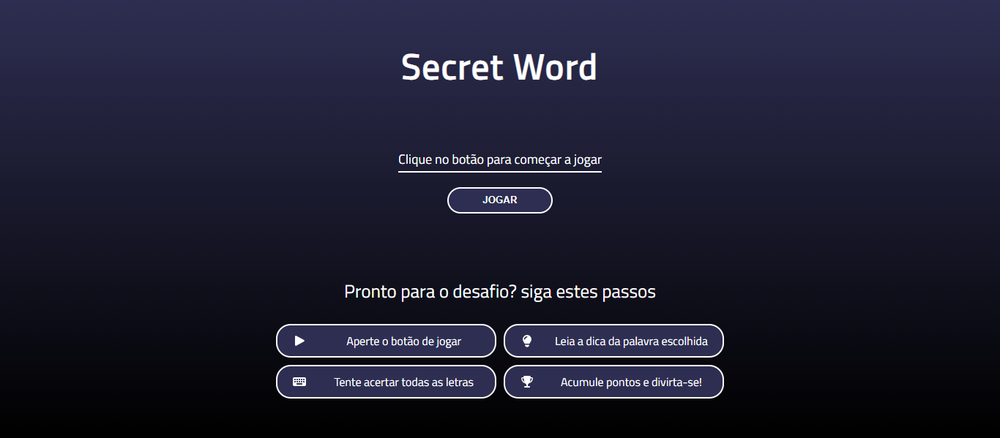
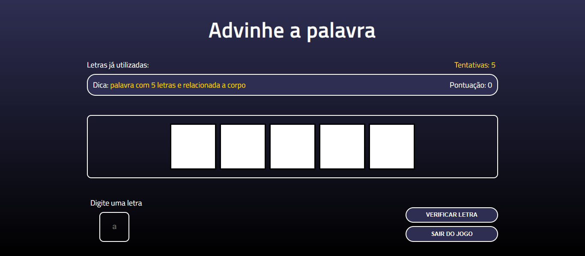
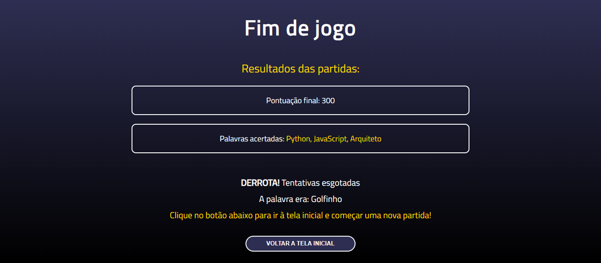

# Secret Word


> Um mini-jogo de adivinhar palavras com um design moderno, construído em React e TypeScript, baseado no projeto do curso de React do Matheus Battisti, mas com funcionalidades e melhorias adicionais.

---

## Índice

- [Sobre](#sobre)
- [Preview](#preview)
- [Funcionalidades](#funcionalidades)
- [Objetivos de Aprendizagem](#objetivos-de-aprendizagem)
- [Tecnologias Utilizadas](#tecnologias-utilizadas)
- [Como Executar](#como-executar)
- [Link do Projeto](#link-do-projeto)
- [Licença](#licença)

---

## Sobre

O **Secret Word** é um jogo onde o jogador deve adivinhar uma palavra secreta com base em uma dica, tendo um número limitado de tentativas.

Este projeto foi inicialmente baseado em um módulo do curso "React do Zero a Maestria", que era originalmente em JavaScript. Eu o refatorei completamente para **TypeScript**, criei um design totalmente novo (dark mode, responsivo) e implementei diversas funcionalidades que não existiam na versão original, focando em uma lógica de jogo mais robusta e uma melhor experiência de usuário.

---

## Preview





---

## Funcionalidades

- **Migração para TypeScript:** Todo o projeto foi reescrito em TypeScript, com tipagem estática para estados, props e refs.
- **Design Responsivo:** Interface adaptável para diferentes tamanhos de tela.
- **Validação Robusta:**
  - O input aceita apenas letras (via Expressão Regular `^[a-z]$/i`).
  - O jogo ignora acentos. O usuário pode digitar "a" e o sistema reconhecerá "á", "ã", etc., graças à função `removeAccents`.
  - Palavras com espaços (ex: "Rio de Janeiro") são processadas corretamente.
- **Melhorias de UX:**
  - **Modal de Aviso:** Um componente `WarnComponent` é exibido se o usuário digitar um caractere inválido.
  - **Gestão de Foco:** O foco é gerenciado entre o input do jogo e o botão de fechar do modal, usando `forwardRef` e `useImperdativeHandle`.
  - **Opção de Sair:** O usuário pode sair do jogo a qualquer momento.
- **Tela de Fim de Jogo Aprimorada:**
  - Mostra a pontuação final.
  - Lista _todas_ as palavras que o usuário acertou durante a partida.
  - Em caso de derrota, revela qual era a palavra secreta.

---

## Objetivos de Aprendizagem

Este projeto foi uma oportunidade para aprofundar e praticar vários conceitos-chave de React e TypeScript:

- **Migração JS para TS:** Praticar a adição de tipagem estática a um projeto React existente.
- **React Hooks:** Uso avançado de `useState` (para gerenciamento de múltiplos estados do jogo), `useEffect` (para lógicas de vitória/derrota), `useCallback` (para otimização de funções) e `useRef`.
- **Advanced React Patterns:** Implementação de `forwardRef` e `useImperativeHandle` para permitir que o componente pai (`App`) controle o foco de elementos DOM dentro de componentes filhos (`GameComponent`, `WarnComponent`).
- **Lógica de Jogo Complexa:** Gerenciamento da transição entre os estágios do jogo (start, game, end).
- **Manipulação de Strings e Regex:** Uso de `normalize()` e `replace()` com Regex para criar a função `removeAccents` e validação de input.
- **Estilização e Responsividade:** Criação de um design do zero com CSS puro, utilizando Flexbox e media queries.
- **Componentização:** Divisão da UI em componentes lógicos e reutilizáveis (Start, Game, GameOver, Warn).

---

## Tecnologias Utilizadas

- **React**
- **TypeScript**
- **Vite** (Ambiente de desenvolvimento)
- **CSS3** (Estilização pura com Flexbox e responsividade)
- **Font Awesome** (Para ícones)

---

## Como Executar

O projeto foi criado com [Vite](https://vitejs.dev/). Para executá-lo localmente, siga os passos abaixo:

1.  Clone este repositório:

    ```bash
    git clone [https://github.com/SEU-USUARIO/secret-word-project.git](https://github.com/SEU-USUARIO/secret-word-project.git)
    ```

2.  Navegue até o diretório do projeto:

    ```bash
    cd secret-word-project
    ```

3.  Instale as dependências:

    ```bash
    npm install
    ```

4.  Execute o servidor de desenvolvimento:

    ```bash
    npm run dev
    ```

5.  Abra [http://localhost:5173](http://localhost:5173) (ou a porta indicada no terminal) em seu navegador.

---

## Link do Projeto

Você pode acessar a versão online do projeto através deste link:

[https://SEU-LINK-AQUI.vercel.app/](https://SEU-LINK-AQUI.vercel.app/)

---

## Licença

Este projeto está sob a licença MIT. Para mais detalhes, consulte o arquivo [LICENSE](LICENSE).
